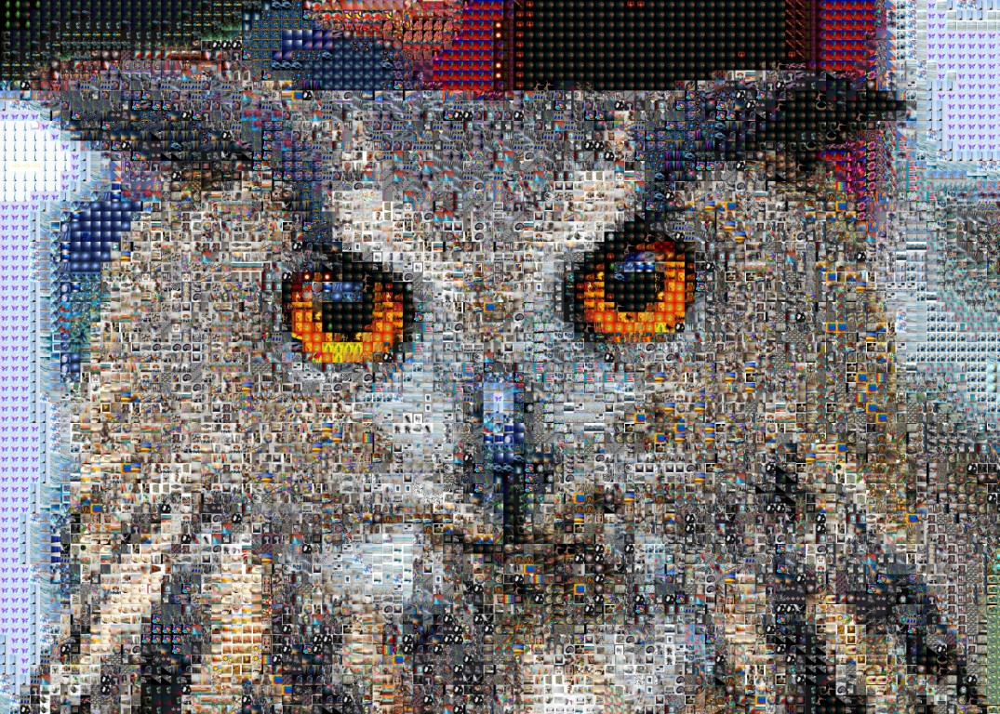
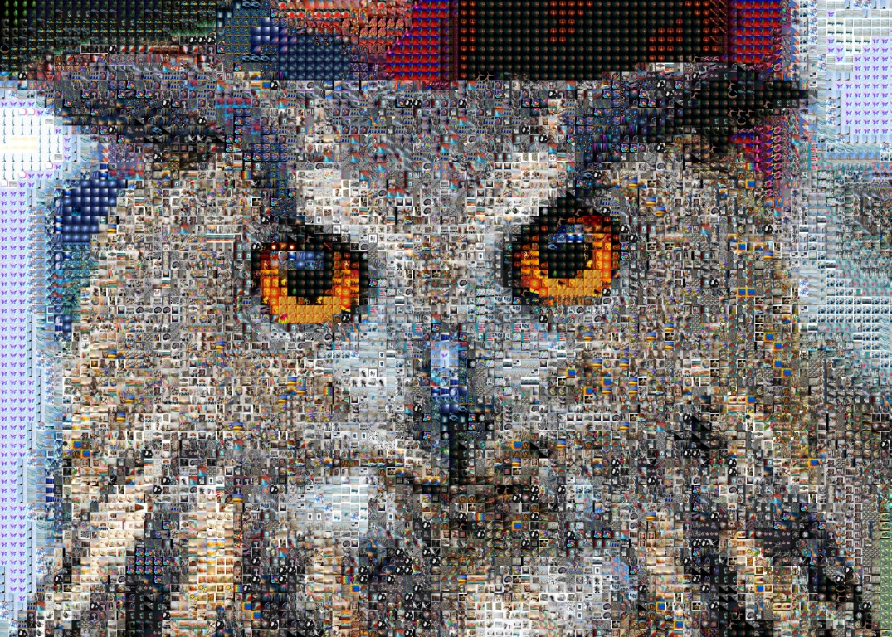

# mosaic
Photo-mosaic web and cli application. Made as a part 3 of the [Go Challange](http://web.archive.org/web/20200721005949/http://golang-challenge.org/go-challenge3/).

> A photographic mosaic, or a photo-mosaic is a picture (usually a photograph) that has been divided into (usually equal sized) rectangular sections, each of which is replaced with another picture (called a tile picture). If we view it from far away or if you squint at it, then the original picture can be seen. If we look closer though, we will see that the picture is in fact made up of many hundreds or thousands of smaller tile pictures.

## Samples

|  |  |  |
|--------|---------|----------|
| [Original](img/samples/Owl.jpg) |  [Euclidean](img/samples/50x50_euclidean.jpg) | [Redmean](img/samples/50x50_redmean.jpg)  |


## CLI

### Load

Load images from Bing image search via [rapidapi](https://rapidapi.com/microsoft-azure-org-microsoft-cognitive-services/api/bing-image-search1/).

```
Usage:
  mosaic load [flags]

Flags:
  -l, --concurrency int   Concurrency level (default 5)
  -c, --count int         Images count (default 100)
  -h, --help              help for load
  -k, --key string        Rapidapi api key
  -o, --out string        Output path (default "images")
  -q, --query string      Image search query
```

### Tiles

Make specified sized square tiles from arbitrary images located in specified folder.

```
Usage:
  mosaic tiles [flags]

Flags:
  -h, --help         help for tiles
  -i, --in string    folder with source images
  -o, --out string   output folder for tiles
  -s, --size int     tile size (px) (default 50)
```

### Create mosaic

Create mosaic from source image using tiles from specified folder.

```
Usage:
  mosaic create [flags]

Flags:
  -d, --distance string   Color distance algorithm: euclidean or redmean (default "redmean")
  -h, --help              help for create
  -i, --in string         Source image
  -l, --library string    Path to tiles library
  -o, --out string        Target image
```

## Web
TBD